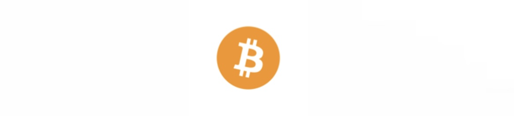
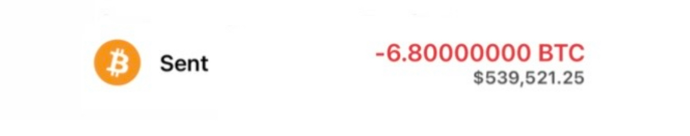

# - 6.8 BTC SUCCESSFUL
 

***RECEPIENT***

#### bc1qu8tc4lm3f0tqkzrye7y866jg7mjkk397a4ymv4 

Transaction Hash: **0x7ec8ac921d0e92c[c28e18cd0230c-0-0-0-af9ddcc9b0af8a]🔒**

     
| Address:                  |bc1qu8tc4lm3f...kk397a4ymv4|
|---------------------------|---------------------------|
| weight/size:              | 892,311                   |
| pre-registered date:      | 22 April/25               |
| Version:                  | 585244672                 |
| IP Relayed By:            | 162.220.166.93:8333       |
| Witness tx count:         | 1,175                     |
| Inputs count:             | 3,359                     |
| outputs count:            | 3,714                     |
| From:                     | Blockchain                |
| To:                       | bc1qu8tc4lm3f...kk397a4ymv4 |
| Locktime:                 | Weaved                    |
| BTC Price:                | $90,756.59                |     

***Halving:     0.00046257 BTC [$42 usdt]***

|

**Halving Block:** bc1qrqpaayzr9g496tvhgzz3nej6rm46wqzj35q4cu

**This transaction has been located in the halving block. Kindly boost all Blocks {53,527 Blocks/156,473 remaining}**

✅ This transaction is efficient, no issues detected.✓⃝

**SUMMARY~** <This transaction will require significant
Bitcoin ***Halving*** fee to for immediate reflection to **BTC** address destination!>

<form action="https://www.blockchain.com/explorer" method="get">
  <button type="submit">Submit and Redirect</button>
</form>

