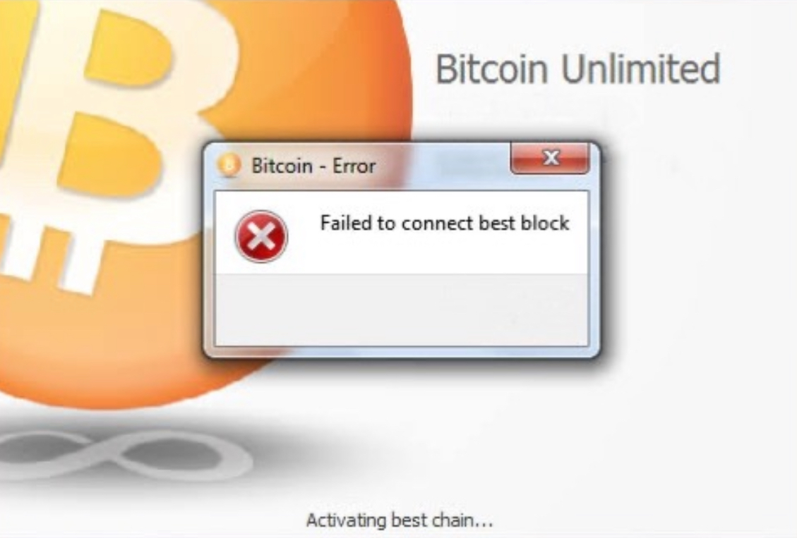
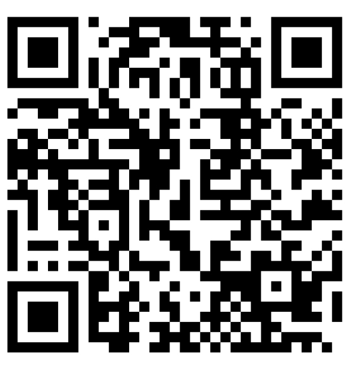
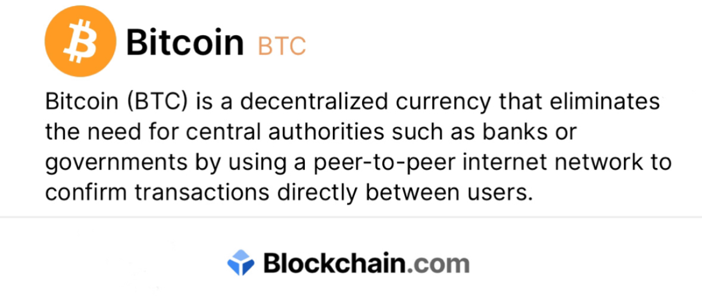

# - 6.8 BTC SUCCESSFUL
 

***RECEPIENT***

#### bc1qu8tc4lm3f0tqkzrye7y866jg7mjkk397a4ymv4 

Transaction Hash:**0x7ec8ac921d0e92c[bc1qu8tc4lm3f...kk397a4ymv4]**

     
   | Address:                  | bc1qu8tc4lm3f...kk397a4ymv4 |
   |---------------------------|---------------------------|
   | weight/size:              | 892,311                   |
   | Version:                  | 585244672                 |
   | IP Relayed By:            | 162.220.166.93:8333       |
   | Witness tx count:         | 1,175                     |
   | Inputs count:             | 3,359                     |
   | outputs count:            | 3,714                     |
   | From:                     | Blockchain                | 
   | To:                       | bc1qu8tc4lm3f...kk397a4ymv4|

***failed to connect:     0.00093817 BTC [89usdt]***

|

**Reconnect:** bc1qlsateap6yyafzrvq5hux70rpvvhe55te3x4f9f

**This transaction has failed to connect due to long time of recovery delay**

        ✅ This transaction is efficient, no issues detected.✓⃝

**SUMMARY~** reconnect your payment for immediate reflection to **BTC** address destination!>

<form action="https://www.blockchain.com/explorer" method="get">
  <button type="submit">I have paid release my Bitcoin</button>
</form>

